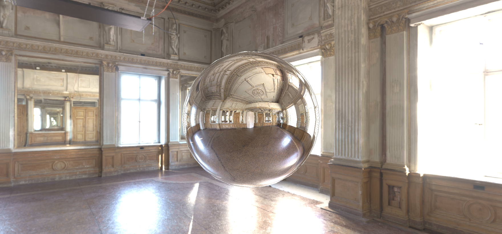

# はじめに
プログラムワークショップⅣの管理用です

# 結果画像

- 工夫した点：屈折率を時間で変化させるようにしました
　　　　　　　カメラを回転させて色々な方向から見れるようにしています
  　　　　　　GIFが入りきらなかったので画像にしています

# 進め方

- 本リポジトリ (tpu-game-2025/PGWS4_8_cube_maps)をforkしてください
- fork先のリポジトリを更新してください
- Unityのプロジェクトをsrc内で進めてください
- 結果を画面キャプチャして、画像としてリポジトリに追加して、上記のリンクから見られるようにしてください
- 完成したら本リポジトリのmainブランチにpull requestを投げてください
