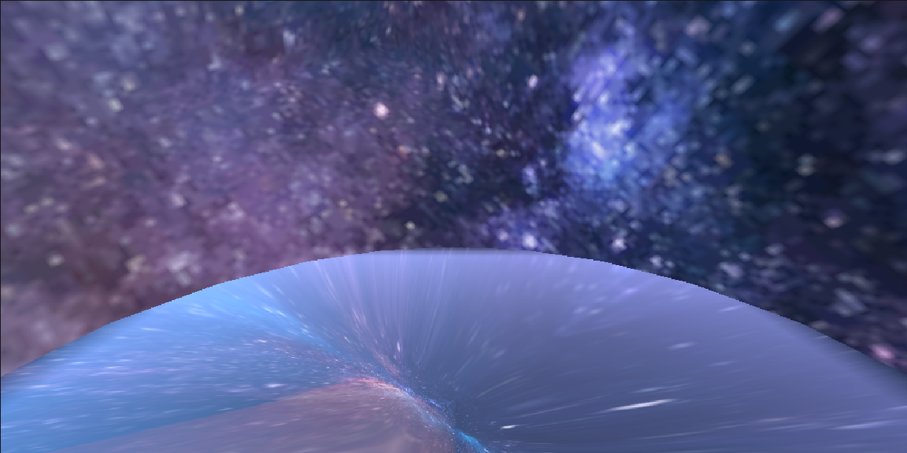

# はじめに
プログラムワークショップⅣの管理用です

# 結果画像

- 工夫した点：星空のフリー画像を変換サービスを用いて用意し、skyboxの状態を床となるオブジェクトに反映させられるものにしようと思い挑戦したが、うまくいかなかったのでTimeノードを用いて回転させたり、明るさをいじったりして実現方法を探った。

# 進め方

- 本リポジトリ (tpu-game-2025/PGWS4_8_cube_maps)をforkしてください
- fork先のリポジトリを更新してください
- Unityのプロジェクトをsrc内で進めてください
- 結果を画面キャプチャして、画像としてリポジトリに追加して、上記のリンクから見られるようにしてください
- 完成したら本リポジトリのmainブランチにpull requestを投げてください
